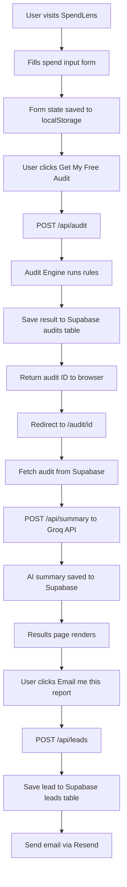

# Architecture

## System Diagram

## Data Flow

1. User fills the spend form → state persists in localStorage on
   every change so page refreshes don't lose data
2. On submit → POST /api/audit with full form JSON
3. API route runs auditEngine.ts — pure deterministic rule-based
   logic, no AI involved here
4. Audit result saved to Supabase with a UUID
5. Browser redirects to /audit/[uuid]
6. Results page fetches the audit by ID from Supabase
7. If no AI summary exists yet → POST /api/summary → Groq generates
   a personalized paragraph → saved back to Supabase
8. User optionally submits email → POST /api/leads → saved to leads
   table → Resend sends confirmation email
9. Shareable URL is just the /audit/[uuid] page with OG meta tags

## Why This Stack

- **Next.js 16** — App Router gives us API routes + frontend in one
  repo. One Vercel deploy covers everything. No separate backend needed.
- **TypeScript** — Catches bugs at compile time. The audit engine
  logic is complex enough that types prevent subtle errors.
- **Tailwind CSS + shadcn/ui** — Fast to build, accessible by
  default, no fighting CSS specificity.
- **Supabase** — Instant Postgres with REST API and row-level
  security. Free tier is generous. No server to manage.
- **Groq API** — Free tier, fast inference, good quality. Better
  choice than Anthropic API for a free tool with no revenue yet.
- **Resend** — Simplest transactional email API. Free tier covers
  development needs.
- **Vercel** — Zero config deploy for Next.js. Auto-deploys on
  every push to main.

## What I'd Change for 10k Audits/Day

1. **Redis cache** — Same tool inputs always produce the same audit
   output.
2. **Background jobs** — Move AI summary generation to a queue
   (BullMQ + Redis) so the API returns instantly and summary
   generates async.
3. **Database indexes** — Add indexes on audits.created_at and
   leads.email for faster queries at scale.
4. **Rate limiting middleware** — Move from per-route honeypot to
   global IP-based rate limiting with Upstash Redis.
5. **CDN for results pages** — Results pages are mostly static
   after creation. Cache them at the edge with Vercel's CDN.
6. **Separate read/write databases** — Use Supabase read replicas
   for the results page fetches to reduce load on the primary.