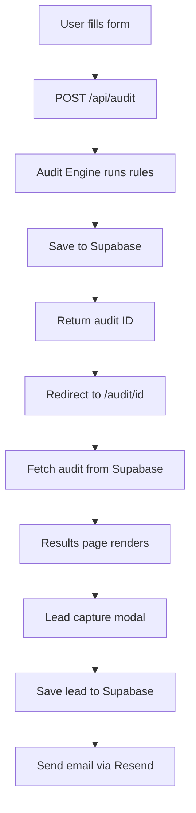

# Architecture

## System Diagram

## Data Flow

1. User fills spend form → state saved in localStorage
2. User submits → POST /api/audit with JSON body
3. API route runs auditEngine.ts — pure rule-based logic
4. Result saved to Supabase audits table with unique UUID
5. Browser redirects to /audit/[uuid]
6. Results page fetches audit by ID from Supabase
7. Page renders savings breakdown + AI summary
8. User optionally submits email → saved to leads table → Resend sends confirmation email

## Why This Stack

- **Next.js** — API routes + frontend in one repo, easy Vercel deploy
- **TypeScript** — catches bugs early, makes audit logic readable
- **Supabase** — instant Postgres with REST API, free tier generous enough
- **Tailwind CSS** — fast styling without context switching
- **Resend** — simplest transactional email API, generous free tier
- **shadcn/ui** — accessible components without fighting CSS

## What I'd Change for 10k Audits/Day

- Add Redis cache for audit results — same inputs = same output, no need to recompute
- Move audit engine to a background job queue (BullMQ) so API returns instantly
- Add a CDN layer for the results page since it's mostly static after creation
- Add database indexes on audits.created_at for faster queries
- Rate limit by IP on /api/audit to prevent abuse