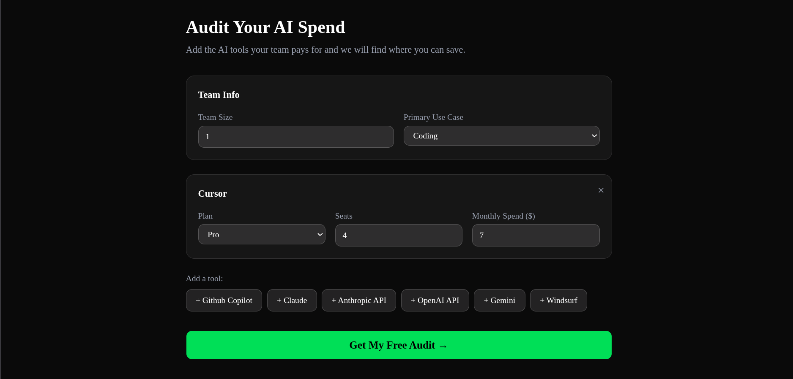
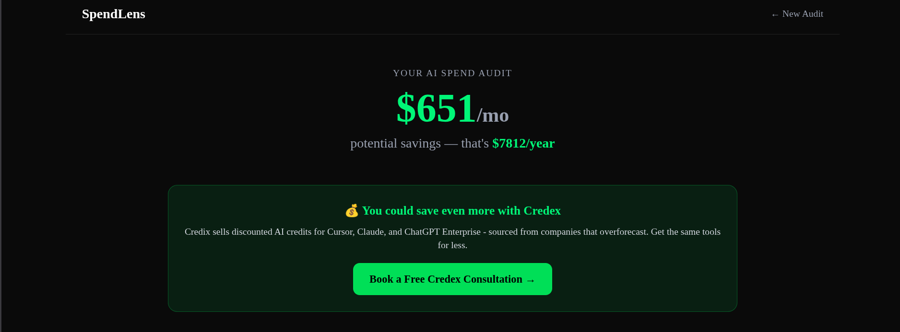
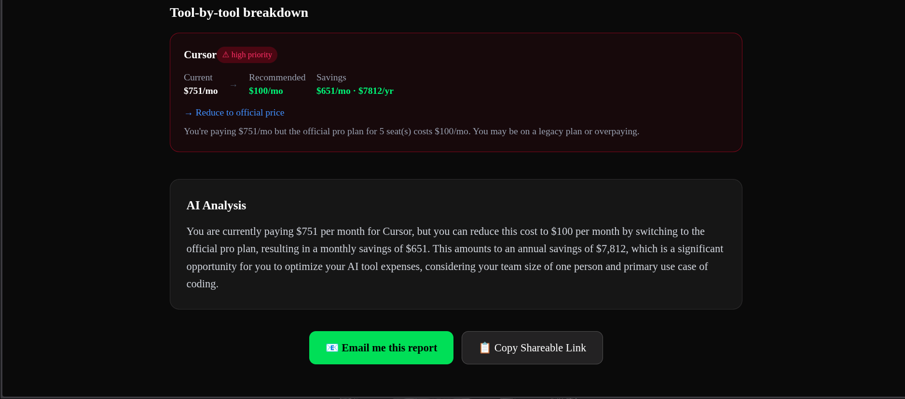
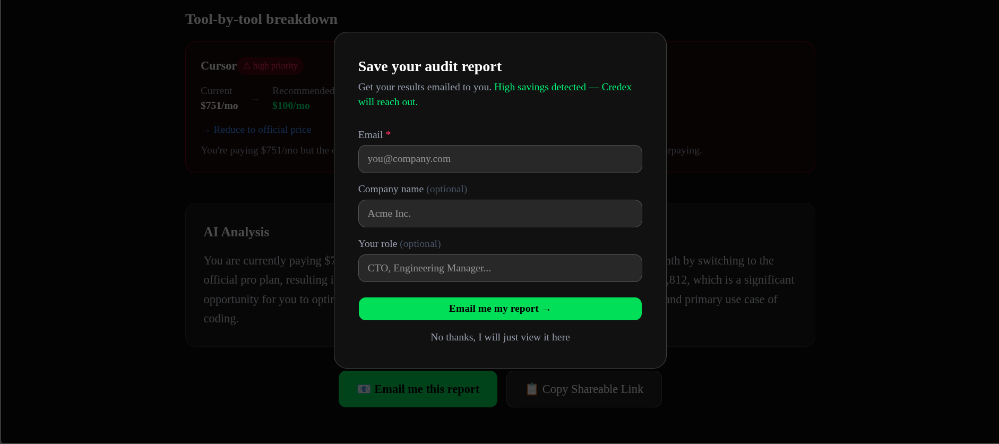

# SpendLens 🔍

> **Free AI tool spend auditor for startups and engineering teams.**

Most startups overpay for AI tools without knowing it. SpendLens analyzes
your Cursor, Claude, ChatGPT, and Copilot spend and tells you exactly
where you can save — in 30 seconds, no login required.

Built as part of the Credex Web Development Internship Assignment.

---

## 🔗 Live Demo

**[https://ai-spend-audit-nno9.vercel.app](https://ai-spend-audit-nno9.vercel.app)**

---

## 📸 Screenshots

### Home Page


### Audit Form


### Results Page



### Email Form Page


---

## ✨ Features

- **Instant audit** — enter your tools, get results in 30 seconds
- **8 AI tools supported** — Cursor, GitHub Copilot, Claude, ChatGPT,
  Anthropic API, OpenAI API, Gemini, Windsurf
- **Defensible audit logic** — every recommendation cites official
  pricing with a reason a finance person would agree with
- **AI-generated summary** — personalized 100-word analysis via Groq
- **Lead capture** — email gate after value is shown, never before
- **Shareable URL** — each audit gets a unique public link with OG previews
- **Form persistence** — state saved to localStorage, survives page refresh

---

## Quick Start

```bash
# Clone the repo
git clone https://github.com/rahul-singh011/ai-spend-audit.git
cd ai-spend-audit

# Install dependencies
pnpm install

# Set up environment variables
cp .env.example .env.local
# Fill in your values in .env.local

# Run locally
pnpm dev

# Run tests
pnpm test

# Run lint
pnpm lint
```

Open [http://localhost:3000](http://localhost:3000) in your browser.

---

## 🔑 Environment Variables

| Variable | Description |
|----------|-------------|
| `NEXT_PUBLIC_SUPABASE_URL` | Your Supabase project URL |
| `NEXT_PUBLIC_SUPABASE_ANON_KEY` | Your Supabase anon key |
| `GROQ_API_KEY` | Groq API key for AI summaries |
| `RESEND_API_KEY` | Resend API key for transactional email |

---

## 🏗️ Tech Stack

| Layer | Technology |
|-------|-----------|
| Frontend | Next.js 16, TypeScript, Tailwind CSS, shadcn/ui |
| Backend | Next.js API Routes |
| Database | Supabase (Postgres) |
| AI Summary | Groq API (llama-3.3-70b-versatile) |
| Email | Resend |
| Deploy | Vercel |
| CI | GitHub Actions |

---

## 🤔 Key Decisions

**1. Next.js over plain React**
API routes and frontend in one repo — one deploy, one codebase,
no CORS issues. Vercel deploy is trivial with Next.js.

**2. Groq over Anthropic API**
Anthropic API requires prepaid credits. Groq free tier with
llama-3.3-70b-versatile gives equivalent summary quality.

**3. Hardcoded rules for audit engine, not AI**
The assignment tests whether you know when not to use AI.
Pricing comparisons are deterministic — hardcoded rules are
faster, cheaper, fully auditable, and a finance person can
verify every line of logic.

**4. Supabase over custom Postgres**
Free tier covers all MVP needs. Built-in REST API and RLS
policies. No server to manage. For 10k audits/day we'd move
to a dedicated instance with connection pooling.

**5. Honeypot over hCaptcha**
hCaptcha adds friction for real users. A hidden honeypot field
catches bots silently with zero UX impact. Documented in
`app/api/leads/route.ts`.

---

## 🧪 Tests

```bash
pnpm test
```

5 tests covering the audit engine — plan overkill detection,
overpaying detection, optimal spend detection, savings math,
and cross-tool recommendations. See `TESTS.md` for details.

---

## 📊 Lighthouse Scores (Mobile — Live URL)

| Metric | Score | Requirement |
|--------|-------|-------------|
| Performance | 89 | ≥ 85  |
| Accessibility | 98 | ≥ 90  |
| Best Practices | 96 | ≥ 90  |
| SEO | 100 | —  |

---
